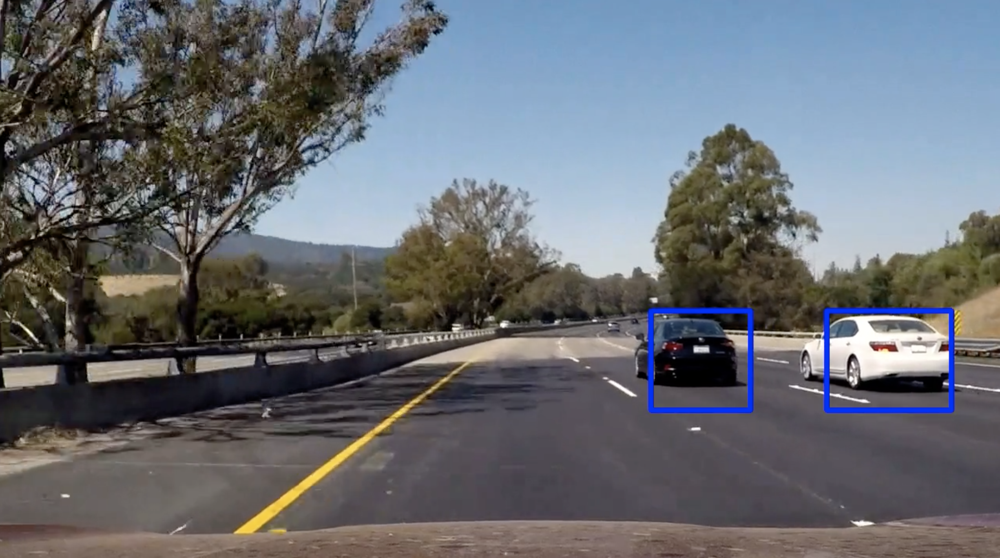
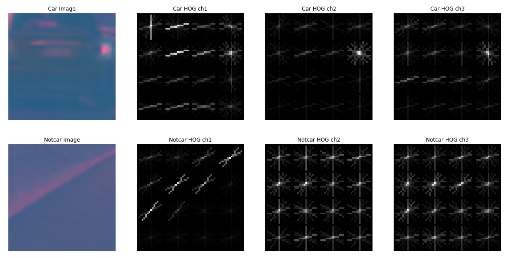
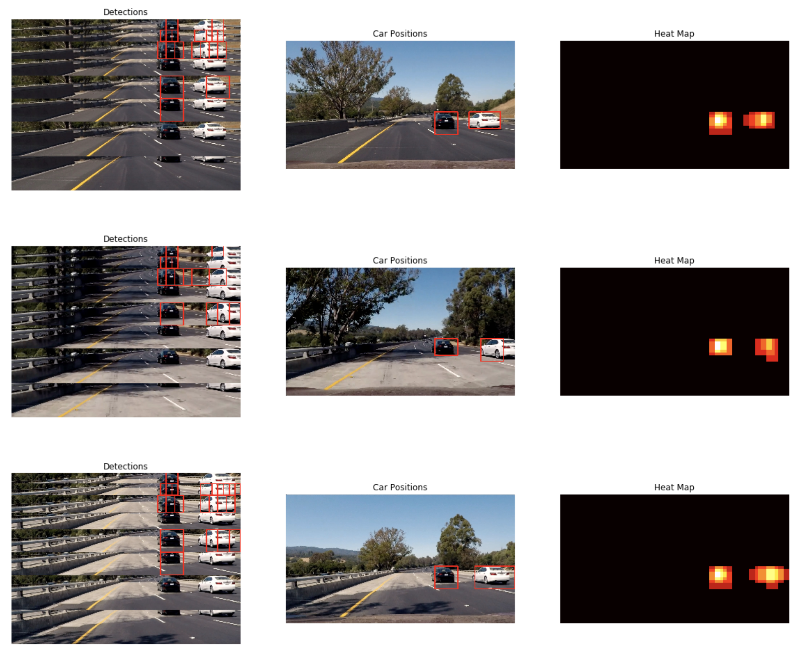
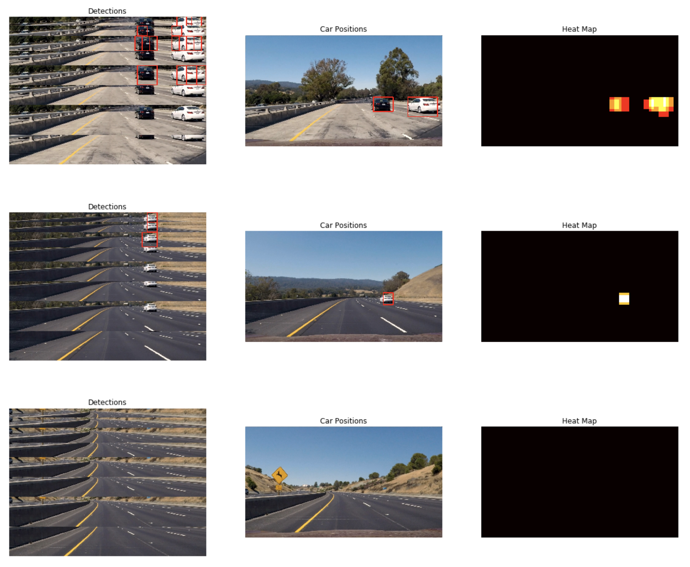

# **Vehicle Detection**

[](http://www.udacity.com/drive)

<div></div>

## Overview

This is my fifth project in [Udacity Self-Driving Car NanoDegree Program](http://www.udacity.com/drive).

In this project, your goal is to write a software pipeline to detect vehicles in a video (start with the test_video.mp4 and later implement on full project_video.mp4).

## Contents

* `P5.ipynb`: jupyter notebook used throughout this project
* `writeup.md`: writeup report that describes the pipeline
* `output_images`
* `output_videos`

## Instructions

Get started [here](https://github.com/udacity/CarND-Term1-Starter-Kit/blob/master/README.md). You can install some softwares needed in this project along the way.

## Project Details

#### Feature Extraction
I explored many combinations of features and its parameters. I found that, even though spatial color features and color histogram features (`bin_spatial()` and `color_hist()` in my code) improved an accuracy of a classifier a bit, it caused a lot of false positive detections. Also increasing the number of features is not good in this case because it can make the vehicle detection pipeline slow to compute. In the end, I used only hog features.

##### Histogram of Oriented Gradients (HOG)
I extracted hog features using `skimage.feature.hog()` function. I controlled hog feature extraction by tuning parameters such as `orient`, `pix_per_cell`, and `cell_per_block`.
Here is my final setting for hog feature extraction.

```
color_space = 'LUV' # Can be BGR, HSV, LUV, HLS, YUV, YCrCb
orient = 9  # HOG orientations
pix_per_cell = 16 # HOG pixels per cell
cell_per_block = 2 # HOG cells per block
hog_channel = 'ALL' # Can be 0, 1, 2, or "ALL"
```

Changing `pix_per_cell` from 8 to 16 reduced the number of hog features but it still contains enough information to identify a car or not. Using hog features of all channels improved an accuracy of a classifier.

The above setting has a total of 3 block positions on 64×64 single channel image, so the number of features per channel is 3×3×2×2×9=324. Having all channels gives a total number of 972 features.

Here is the example of hog features of car and notcar image (using LUV color space).
<div></div>

#### Training and Classifier
The data set I used in this project contains 8792 car images and 8968 notcar images (provided by Udacity).
I first extracted hog features for the entire data set and prepared labels for car and notcar features. The labels could be 1 (car) or 0 (notcar). The features and labels were then shuffled and split into training and test set (80% for training, 20% for test).

I used a linear SVM classifier, as Udacity recommended. I didn't use scaling method (`sklearn.preprocessing.StandardScaler()`) for features.

Here is some stats from training.

```
Using: 9 orientations 16 pixels per cell and 2 cells per block
Feature vector length: 972
0.74 Seconds to train SVC...
Test Accuracy of SVC =  0.9873
```

I also tried data augmentation technique (flipping images horizontally). It improved an accuracy of a classifier a little bit, but it didn't really help in the later setting (processing video). I guess maybe hog features were already general enough to identify a car or not.

#### Sliding Window Search
Before doing sliding window search, features were extracted for a entire region of interest of an image in advance, because extracting hog features for one window at each time is time-consuming. Then for each sliding window, corresponding features were subsampled and fed to the classifier to make prediction.

Window size was scaled to some different sizes to deal with different sizes of cars depending on their positions. The overlap of sliding window was 75%.
After all predictions done in an image, I got a list of bounding box positions for car detections.

Since true positive detections often have duplicate bounding boxes and false positive detections have one, I created heatmap and had threshold to reduce false positive and combine duplicate detections into one. Then I got final bounding box positions using `scipy.ndimage.measurements.label()` function.

Here are some examples of detection, final car position, and heatmap.
<div></div>
<br>
<div></div>

On the left most column, different window sizes on different regions of interest are stacked. On the right most column, heatmaps are shown. On the middle column, this is the final output.

#### Video
Here are the results of two videos.

| Test video                                         | Project video                                 	          |
|:--------------------------------------------------:|:--------------------------------------------------------:|
|||

As I said in the previous section, in order to reduce the number of false positives and overlap detections, I used heatmap and threshold.

But, for video, I defined a class for detected bounding boxes and kept all of detected bounding boxes as a history. And for each frame, I used all detections of 30 frames and created heatmap and thresholded detections.

#### Discussion
I had hard time to reduce false positives. Even if I tuned parameters, chose features and got good classifier identifying a car or not, tried different window sizes, most of the time, it caused false positives. It can even sometimes make situation worse!
So those features including hog features are not general enough and vulnerable to changing conditions (it works in simple situations like subway, but it maybe doesn't work in more complicated situations like downtown or junction or in a rainy day).
And also hand-coded sliding window search is actually inefficient and time-consuming.
To make pipeline more robust and more real-time, deep learning approaches such as YOLO and SSD are good candidates to try next.
